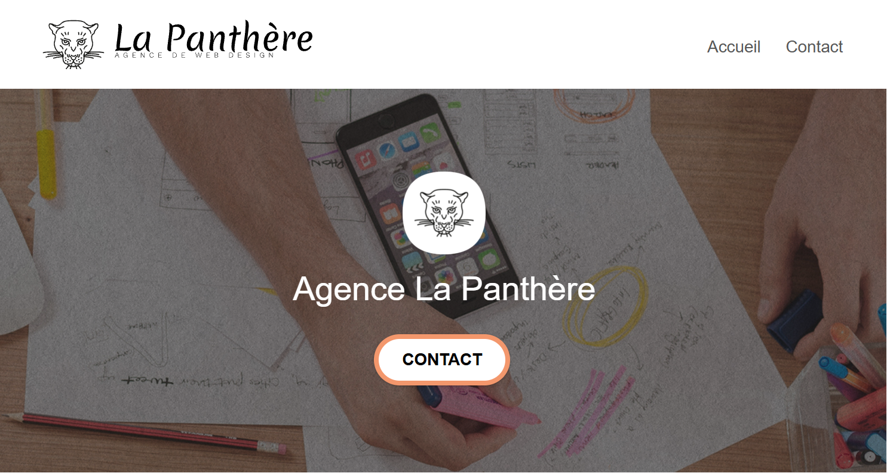

# La Panthère - Agence Web Design (Projet 4)

Optimisation SEO, Accessibilité et Performance d'un site web existant pour l'agence de web design "La Panthère".

## 🚀 Voir le projet en ligne

[👉 Cliquez ici pour voir le site optimisé](https://chaimaa-as.github.io/LaPanthere/)

## 📖 Contexte du projet

La Panthère est une agence de web design basée à Lyon. L'objectif de ce projet était d'intervenir sur le code d'un site web existant (mais vieillissant et mal optimisé) afin d'améliorer son référencement naturel (SEO), son accessibilité, et ses performances globales (temps de chargement).

## 🎯 Améliorations apportées

- **Performance** : Compression et redimensionnement des images (formats WebP/JPG optimisés), minification du code CSS et JavaScript.
- **SEO** : Ajout et optimisation des balises meta (title, description), hiérarchisation sémantique stricte des balises HTML (H1, H2, H3...).
- **Accessibilité** : Ajout d'attributs `alt` pertinents sur les images, amélioration du contraste des couleurs (normes WCAG), ajout de labels ARIA pour les lecteurs d'écran.
- **W3C** : Correction des erreurs de syntaxe HTML et CSS pour un code 100% valide.

## 🛠️ Outils utilisés

- Google Lighthouse (Audit de performance et SEO)
- WAVE Evaluation Tool (Audit d'accessibilité)
- Validateurs W3C (HTML & CSS)
- Git & GitHub

## 📊 Rapports et Soutenance

Tout le processus d'audit et d'optimisation a été documenté. Vous pouvez consulter mes rapports ci-dessous :

- [📄 Rapport d'analyse SEO (Comparatif Avant/Après)](./analyse-seo-avant-apres.pdf)
- [📄 Rapport d'optimisation (Actions menées)](./rapport-optimisations.pdf)
- [📄 Support de présentation de la soutenance](./presentation-lapanthere.pdf)

## 💻 Installation locale

1. Clonez ce dépôt : `git clone https://github.com/Chaimaa-as/lapanthere.git`
2. Ouvrez le fichier `index.html` dans votre navigateur.
